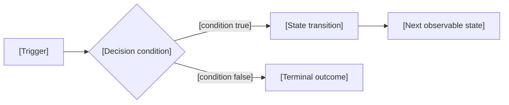

# Optional Libraries

Use a library only when it solves a concrete rendering or interaction problem that semantic HTML, CSS, SVG, or the standard library does not solve simply.

## Mermaid

Use Mermaid for connected graphs whose automatic layout is useful:

- flowcharts with branching;
- sequence diagrams;
- state diagrams;
- entity relationships;
- class or dependency diagrams.

Keep each diagram focused on one technical question. Split a large system by mechanism instead of pairing a thumbnail overview with prose cards.

### Generation-time rendering

Render Mermaid before delivery and embed the SVG. The artifact stays self-contained and does not depend on a runtime CDN.

When `mmdc` is available:

```bash
mmdc -i diagram.mmd -o diagram.svg -b transparent
```

Embed the resulting SVG and add local zoom/pan mechanics from `../templates/mermaid-flowchart.html`.

When `mmdc` is unavailable, use direct SVG or another code-native representation rather than installing tooling during the task. ELK and other optional layouts are generation-time choices only.

Derive colors from project or platform semantic tokens during rendering.

### Source-shaped graph scaffold



Replace every bracketed label from the source ledger. Every decision edge receives its branch condition. Differing terminal outcomes receive separate nodes.

### Label mechanics

- Quote labels containing punctuation.
- Escape literal pipes as `#124;`.
- Use `<br/>` only when a measured label needs a deliberate line break.
- Keep node labels concise and move explanation beside the diagram.
- Provide a textual alternative that states the same relationships.

### Interaction

For zoom and pan mechanics, use `../templates/mermaid-flowchart.html`.

- Ctrl/Cmd + wheel controls zoom.
- Ordinary wheel input preserves page scrolling.
- Pointer drag pans only when zoomed.
- Buttons provide zoom in, zoom out, fit, and 1:1.
- The viewport has a useful accessible name and keyboard focus only when it scrolls or accepts controls.

## Charts

Use a semantic table or direct SVG for measured data so the delivered artifact remains self-contained. A chart requires a named metric, unit, provenance, meaningful axis, and a relationship or threshold the reader needs to see.

Pair the chart with one sentence stating the behavior visible in the data and a source note for the measurements.

## Syntax highlighting

Use Shiki at generation time rather than a browser runtime. Embed the rendered token HTML so the artifact remains self-contained.

Source excerpts remain exact and preserve indentation. A compressed teaching excerpt is visibly labeled `Simplified excerpt`.

## Typography

Use the project's existing type system when available. Otherwise use platform stacks:

```css
:root {
  --font-body: ui-sans-serif, system-ui, -apple-system, "Segoe UI", sans-serif;
  --font-mono: "SFMono-Regular", Consolas, "Liberation Mono", monospace;
}
```

Load external fonts only when the user requests them or the subject has an established visual identity that requires them.
